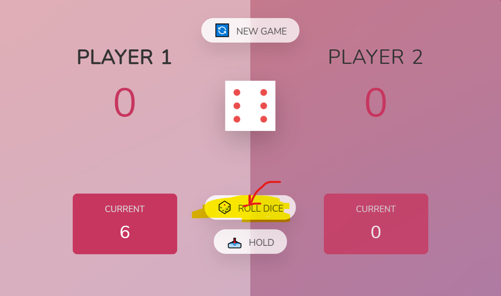
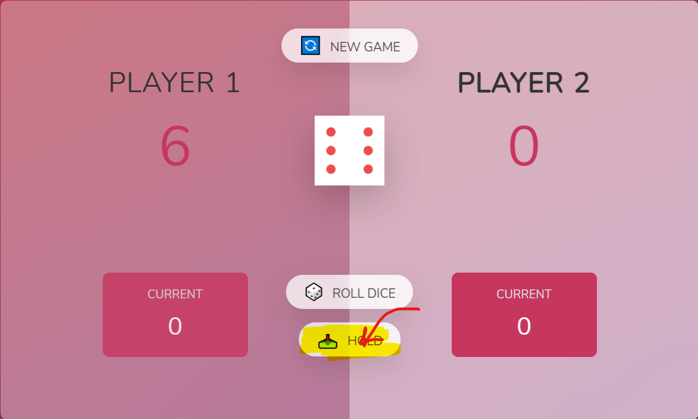
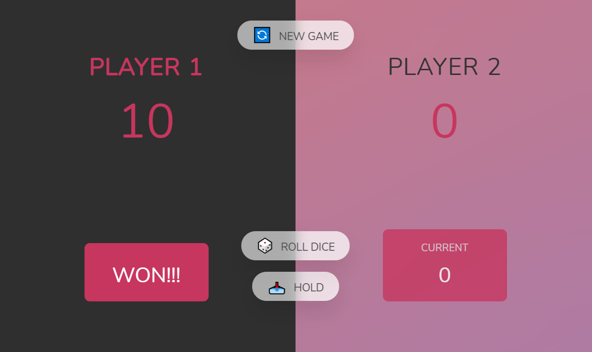
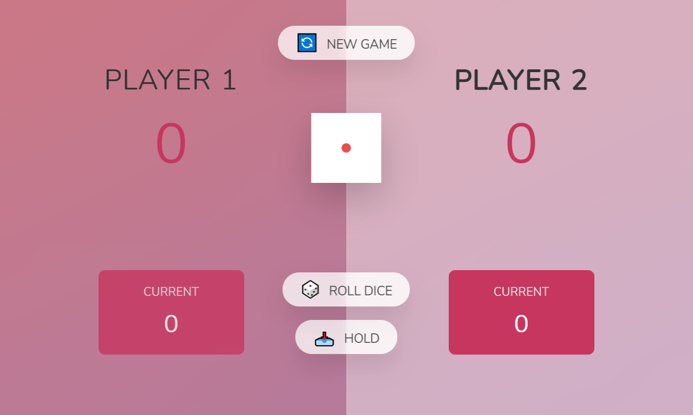
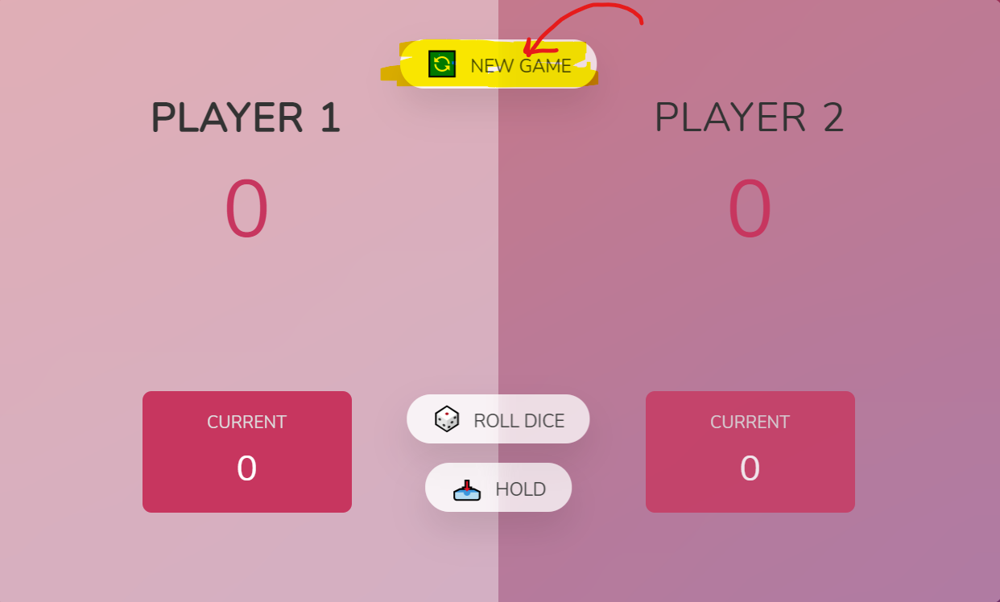

# <u><h1 align="center" >Uni-Dump</h1></u>

<u><h1 align="center">Description:</h1></u>

## It's a dice-based game which can be played only on PC. Here random number generator JS function is used for dice-roll value.

## <u>Link</u>: https://uni-dump.netlify.app/

<u><h1 align="center">How To play:</h1></u>

## 0. The game starts with player 1.

## 1. Roll the dice and then press hold button for next player turn

## 2. Player who gets a total score of 10 first win the game

## 3. However if the dice roll is "1" the you are dumped that is total score will become 0 and player gets switched without pressing hold button.

## 4. To reset Game press new game button

<u><h1 align="center">To Contributors:</h1></u>

## We are having issues in making it mobile and Ipad responsive using only CSS. Contributors are required to make it responsive using only CSS without any framework like Bootstrap for merging Pull-request.

## Contact: shounmaydarsh131@gmail.com
